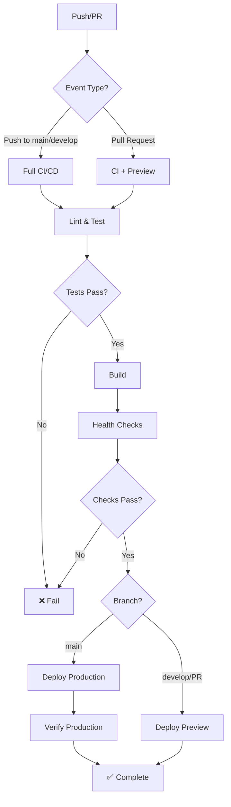

# CI/CD Pipeline Documentation

## Overview

GoInvestMe uses GitHub Actions for continuous integration and deployment, following 12 Factor App principles for Build, Release, and Run stages.

---

## Workflows

### 1. CI/CD Pipeline (`ci-cd.yml`)

**Triggers**:
- Push to `main` or `develop` branches
- Pull requests to `main` or `develop` branches

**Jobs**:

#### Lint Job
- Runs ESLint for code quality
- Runs TypeScript compiler check
- Fails on TypeScript errors
- Continues on ESLint warnings

#### Test Job
- Runs all unit and integration tests
- Generates code coverage report
- Uploads coverage to Codecov
- Runs in parallel with Lint job

#### Build Job
- Builds Next.js production bundle
- Creates production environment variables
- Uploads build artifacts
- Only runs if Lint and Test pass

#### Health Check Job
- Starts built application
- Tests `/api/health` endpoint
- Tests `/api/ready` endpoint
- Tests `/api/status` endpoint
- Verifies all health checks pass
- Requires successful build

#### Deploy Preview (PR only)
- Deploys to Vercel preview environment
- Creates unique URL for each PR
- Only runs on pull requests
- Requires health checks to pass

#### Deploy Production (main only)
- Deploys to production Vercel environment
- Only runs on `main` branch pushes
- Requires health checks to pass
- Verifies production deployment health

#### Security Scan
- Runs `npm audit`
- Runs Snyk vulnerability scan
- Continues on warnings
- Fails on high-severity vulnerabilities

---

### 2. Code Quality (`code-quality.yml`)

**Triggers**:
- All pull requests

**Checks**:
- Code formatting (Prettier)
- TypeScript compilation
- Console.log detection
- Bundle size analysis
- Automated PR comments

---

### 3. Dependabot (`dependabot.yml`)

**Schedule**: Weekly (Mondays at 9:00 AM)

**Updates**:
- Frontend npm dependencies
- Blockchain npm dependencies  
- GitHub Actions versions

**Limits**:
- Max 10 PRs for frontend
- Max 5 PRs for blockchain
- Ignores major version updates for React/Next.js

---

## Required GitHub Secrets

Configure these secrets in GitHub repository settings:

### Deployment Secrets

```
VERCEL_TOKEN              # Vercel deployment token
VERCEL_ORG_ID             # Vercel organization ID
VERCEL_PROJECT_ID         # Vercel project ID
```

### Contract Addresses

```
SEPOLIA_CONTRACT_ADDRESS  # Sepolia testnet contract address
MAINNET_CONTRACT_ADDRESS  # Mainnet contract address (future)
```

### Monitoring Secrets

```
SENTRY_DSN                # Sentry error tracking DSN
```

### Security Scanning (Optional)

```
SNYK_TOKEN                # Snyk security scanning token
CODECOV_TOKEN             # Codecov coverage upload token
```

---

## Setting Up Secrets

### 1. Vercel Deployment

**Get Vercel Token**:
```bash
# Install Vercel CLI
npm i -g vercel

# Login and get token
vercel login
vercel whoami
```

**Get Project IDs**:
```bash
cd frontend
vercel link
cat .vercel/project.json
```

**Add to GitHub**:
1. Go to repo Settings → Secrets and variables → Actions
2. Click "New repository secret"
3. Add each secret:
   - `VERCEL_TOKEN`: From Vercel account settings
   - `VERCEL_ORG_ID`: From `.vercel/project.json`
   - `VERCEL_PROJECT_ID`: From `.vercel/project.json`

### 2. Sentry DSN

```bash
# Get from Sentry project settings
# Format: https://key@o0.ingest.sentry.io/project-id
```

### 3. Contract Addresses

```bash
# From blockchain deployment
SEPOLIA_CONTRACT_ADDRESS=0x8b23a938d1a52588de989a8967a51e2dde0f494f
```

---

## Workflow Diagram



---

## Build Process (Factor V)

### 1. Build Stage
```bash
npm ci                    # Install exact dependencies
npm run lint             # Code quality
npm test                 # Run tests
npm run build            # Create production build
```

**Output**: Build artifacts in `.next/` directory

### 2. Release Stage
```bash
vercel --prod            # Deploy to production
```

**Output**: Versioned deployment with unique URL

### 3. Run Stage
```bash
npm start                # Start production server
```

**Output**: Running application serving traffic

---

## Environment-Specific Builds

### Development
```bash
npm run dev              # Hot reload, source maps, debug mode
```

### Staging/Preview
```bash
npm run build            # Production build with preview config
npm start                # Serve on preview URL
```

### Production
```bash
npm run build            # Optimized production build
npm start                # Serve on production domain
```

---

## Deployment Environments

### Preview (PR Deployments)
- **URL**: `https://goinvestme-pr-{number}.vercel.app`
- **Trigger**: Every PR commit
- **Config**: `.env.preview` or PR-specific variables
- **Purpose**: Test changes before merging

### Production
- **URL**: `https://goinvestme.vercel.app`
- **Trigger**: Push to `main` branch
- **Config**: Production environment variables
- **Purpose**: Live user-facing deployment

---

## Automated Checks

### Pre-Deployment Checklist
- ✅ All tests pass
- ✅ TypeScript compiles without errors
- ✅ Build completes successfully
- ✅ Health endpoints respond correctly
- ✅ No high-severity vulnerabilities
- ✅ Code coverage meets threshold

### Post-Deployment Verification
- ✅ Production health check passes
- ✅ Sentry error tracking active
- ✅ Logs streaming correctly
- ✅ Application accessible

---

## Manual Deployment

### Vercel CLI

**Deploy to Preview**:
```bash
cd frontend
vercel
```

**Deploy to Production**:
```bash
cd frontend
vercel --prod
```

**View Deployment Logs**:
```bash
vercel logs
```

---

## Rollback Procedure

### Via Vercel Dashboard
1. Go to Vercel project deployments
2. Find previous working deployment
3. Click "Promote to Production"

### Via CLI
```bash
# List deployments
vercel ls

# Rollback to specific deployment
vercel alias set <deployment-url> goinvestme.vercel.app
```

---

## Monitoring CI/CD

### GitHub Actions Dashboard
- View workflow runs: `Actions` tab
- Check job status
- Download artifacts
- View logs

### Vercel Dashboard
- Deployment status
- Build logs
- Runtime logs
- Analytics

### Alerts
- GitHub: Email on workflow failure
- Vercel: Email/Slack on deployment failure
- Sentry: Error spike notifications

---

## Troubleshooting

### Build Failures

**TypeScript Errors**:
```bash
cd frontend
npm run type-check
```

**Test Failures**:
```bash
cd frontend
npm test -- --verbose
```

**Environment Variables Missing**:
- Check GitHub secrets are set
- Verify secret names match workflow

### Deployment Failures

**Vercel Timeout**:
- Check build logs
- Optimize bundle size
- Split large dependencies

**Health Check Failures**:
- Verify endpoints locally
- Check environment variables
- Review application logs

---

## Performance Optimization

### Build Time Optimization
- Use `npm ci` instead of `npm install`
- Cache `node_modules`
- Parallelize jobs when possible
- Use build artifacts

### Deploy Time Optimization
- Enable Vercel build cache
- Use incremental static regeneration
- Optimize image sizes
- Tree-shake unused code

---

## Security Best Practices

### Secrets Management
- ✅ Never commit secrets to git
- ✅ Use GitHub encrypted secrets
- ✅ Rotate tokens regularly
- ✅ Use minimal permission tokens
- ✅ Review secret access logs

### Dependency Security
- ✅ Run `npm audit` regularly
- ✅ Enable Dependabot alerts
- ✅ Review dependency updates
- ✅ Use Snyk for deep scanning
- ✅ Pin critical dependency versions

---

## Future Enhancements

### Planned Improvements
- [ ] Add E2E tests with Playwright
- [ ] Implement blue-green deployments
- [ ] Add canary deployments
- [ ] Integrate with Sentry releases
- [ ] Add performance budgets
- [ ] Implement automatic rollback on errors
- [ ] Add smoke tests post-deployment

---

## See Also

- [12 Factor App: Build, Release, Run](https://12factor.net/build-release-run)
- [GitHub Actions Documentation](https://docs.github.com/en/actions)
- [Vercel Deployment Documentation](https://vercel.com/docs)
- [Dependabot Documentation](https://docs.github.com/en/code-security/dependabot)
